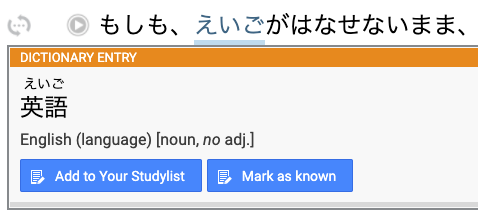

# Satori Reader Extension
This extension is for enhancing the reading experience on satorireader.com for Japanese learners.

## Marking Kanji as Known
When viewing words there is a new button called "Mark as known" that will add the characters in that word
to your Custom Known Kanji list.

**Note**: You will need to refresh your browser for the page to update the existing kana/furigana on with the 
new information.

## Browser Support
This extension has only been tested on Google Chrome for Mac 86.0.4240.80 (Official Build) (x86_64).
